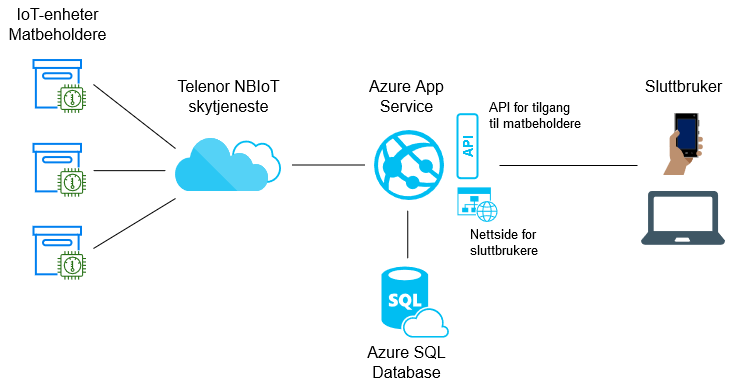

# FoodNotWaste: IoT-prototype for reduksjon av matsvinn
Prosjekt i TIØ4852 Eksperter i team - The Big Bang of the Internet.

En konseptskisse for en IoT-basert løsning for reduksjon av matsvinn i dagligvarebransjen.

## Systemets oppbygning

### Nettside og web-API
`EitIotService` er et ASP.NET Core-prosjekt som inneholder en prototype for nettsiden og API-et som løsningen tilbyr. Nettsiden er en enkel mock-up ment for å visualisere funksjonene som tilbys sluttbrukeren, og skal gi brukeren oversikt over og tilgang til matbeholdere. Denne nettsiden kommuniserer med tjenesten vår gjennom et enkelt API, hvor en skal kunne hente siste måledata fra de forskjellige sensorenhetene og reservere seg tilgang til matbeholderne.

API-et er definert i kontrolleren `EitIotService/Controllers/FoodBoxController.cs`, og mock-up av nettsiden finnes under `EitIotService/wwwroot`.

Prototypen av nettløsningen ble rullet ut i produksjon som en App Service i Microsoft Azure. En Azure SQL-database ble benyttet for lagring av sensor- og måledata.

### Arduino og sensorsystem
Programkoden til Arduinoen som ble brukt i prototypen finnes under mappen `Arduino`. Denne gjør avstands- og temperaturmålinger jevnlig og sender dette til Telenors NBIoT-skytjeneste, som sender dataen videre til vår nettløsning.

## Teknologi og elektronikk benyttet
- Arduino Uno
- EE-NBIOT-01
- HC-SR04 ultralydsensor
- DS18B20 temperatursensor
- ASP.NET Core 3.1
- Microsoft Azure App Service
- Microsoft Azure SQL Database
